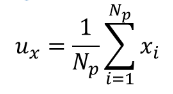
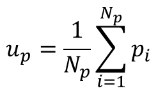
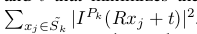
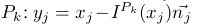

# Laser Registeration algorithm

### ICP

<dev align=center></dev>


Given two set of point cloud,

<dev align=center></dev>

find rotation matrxi R and translation t to minimize

<dev align=center></dev>


**when the corresponding point pairs are known**  

+ , , 

where  and  represent the center of point cloud X and point cloud P.

+ center the point cloud

<dev align=center></dev>

<dev align=center></dev>

+ the closed solution of ICP is 

<dev align=center></dev>

**when the corresponding point pairs are unknown**  

+ find corresponding points(nearest points)

+ compute R and t according to matched points

+ apply R and t to source point cloud, compute the error

+ iterate until the error is smaller than a threshold


### IMLS(Implicit Moving Least Square) ICP

<dev align=center></dev>

IMLS defines a function  as an approximate distance of any point x in  to the implicit surface defined by the point cloud 

<dev align=center></dev>

the weights  are defined as:

<dev align=center></dev>

and  is normal vector of point 

Now we want to localize the current scan  in previous scan . To do so, we want to minimize the sum of squared IMLS distances: . Due to exponential weights, we cannot approximate that nonlinear least-square optimization problem by a linear least-square one, as in ICP point to plane. Instead of minimizing that sum, we project every point  of  on the IMLS surface defined by  where  is the normal of the closest point to  and is a good approximation of the surface normal at projected point 

Now the new cost function is: 

<dev align=center></dev>


### Code
`champion_nav_msgs` has to be installed
```
cd exercise4_Laser_registeration
catkin_make
source devel/setup.bash
```
**1. use IMLS to register the laser data**

`rosrun imlsMatcher imlsMatcher_node`

result is shown in rviz, 

red path: from odometry 

green path: from IMLS

<dev align=center></dev>

**2. use csm library(point-to-line) to register the laser data**

`rosrun csmMatcher csmMatcher_node`

result is shown in rviz,

red path: from odometry 

green path: from csm

<dev align=center></dev>

