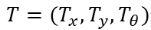
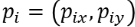
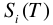
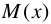
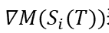
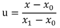
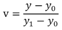

# Laser Regiseration using Gauss-Newton Method

## Generate a likelihood field of laser data

<dev align=center></dev>

## Registeration based on optimization method

target function:

<dev align=center></dev>


where

+  represents pose of robot

+  represents coordinate of i-th laser point

+  represents the transformed coordinate of i-th laser point

<dev align=center></dev>

+  represents the value at the likelihood field

**H and b of GN:**

<dev align=center></dev>

<dev align=center></dev>

 represents the derivative of likelihood field value with respect to position. Since the likelihood field is discrete, we have to use interpolation to solve it.

**Bilinear interpolation**

assume that there are 4 points on a plane

<dev align=center></dev>

let  and 

the coresponding coordinates become:

<dev align=center></dev>

base function of Lagrangian Interpolation:

<dev align=center></dev>

so the interpolation function is:

<dev align=center></dev>

plug x and y back to the function:

<dev align=center></dev>

so we can obtain the derivative of x and y, respectively:

<dev align=center></dev>

<dev align=center></dev>


## Code
start `roscore` and `rviz`

play bag file

`rosbag play --clock odom.bag`

```
cd exercise5_Laser_registeration_GN
catkin_make
source devel/setup.bash
rosrun gaussian_newton_scanmatcher gaussian_newton_node
```

the result is shown in rviz:

<dev align=center></dev>

green path is the ground truth of robot trajectory

red path is the GN optimized trajectory.
